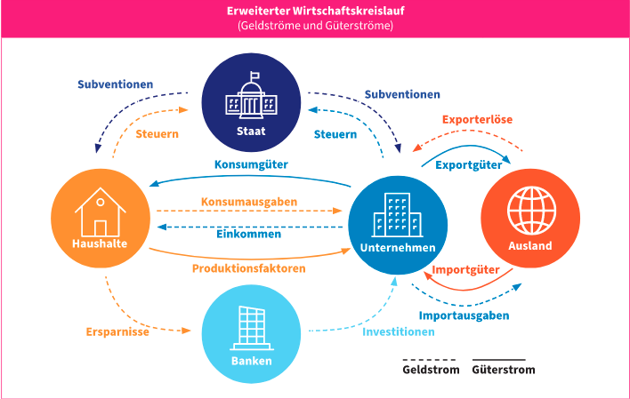
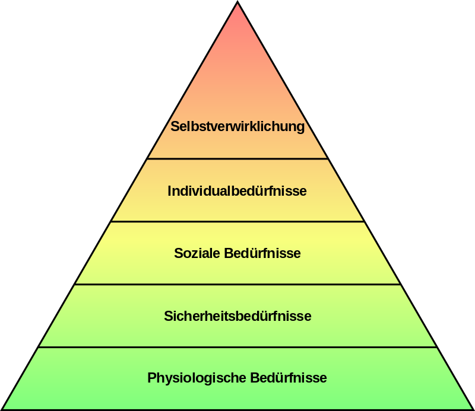

= Wirtschaft

== Eigenschaften der Wirtschaft

. Verkäufer <--> Käufer
. Produzent <--> Konsument
. Anbieter <--> Nachfrager
. Unternehmen <--> Haushalt
. *Argeibteber <--> Arbeitnehmer*

=== Bedürfnisse

. Grund - B; Lebensnotwendige - B
. Sozial - B, Kultur - B
. Luxus - B

Unendlich Bedürfnisse <--> Wirtschaft(*Preis*) <--> Ressourcen

== Wirtschaftliche Systeme
* *freie Marktwirtschaft*: Angebot und Nachfrage bestimmen den Preis -> Vieles zu teuer, oft Produkte zu teuer, weil es sich nicht rechnet. *Unternehmer* kann Gewinn behalten =>
    ** Investieren
    ** Innovation
    ** Arbeitsplätze
    ** Wohlstand
    ** Multiplikator (Wachstum)
    ** Materialien sind Privateigentum
* Soziale Marktwirtschaft: Staat regelt Wirtschaft/Versorgung; wenn z.B.: Behinderte nicht arbeiten können, bekommen sie Beihilfe.
* Ökosoziale Marktwirtschaft